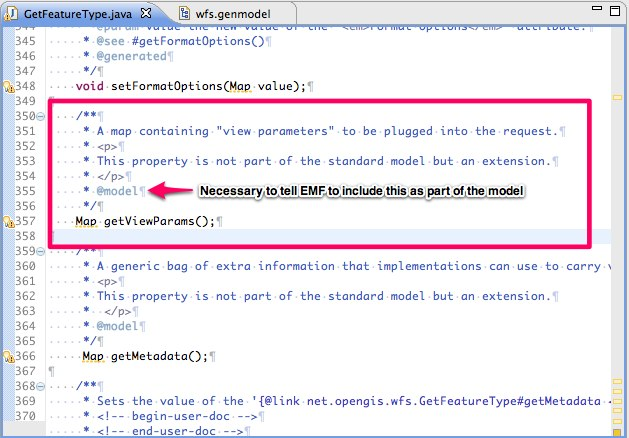
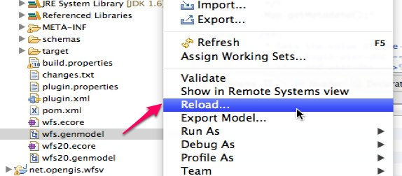
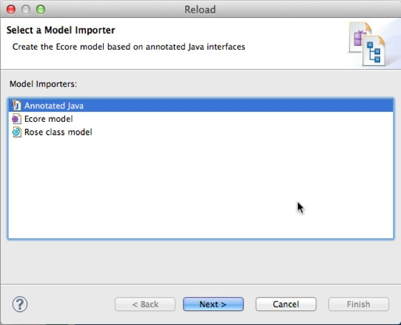
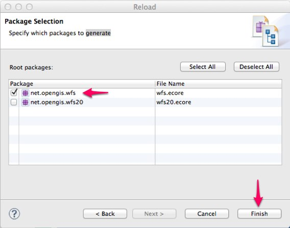
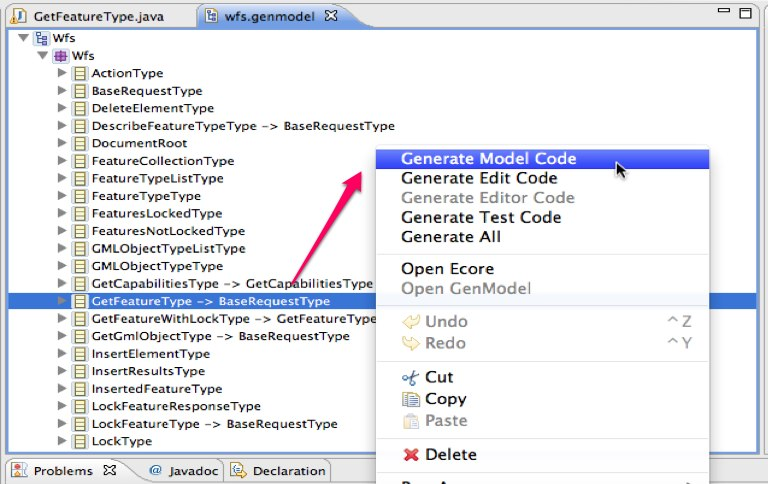

EMF Model README
================

This README describes how to work with the EMF models in GeoTools and in 
particular how to instrument the models in order to add new properties and 
modify existing properties.

Eclipse Setup
-------------

Updating the EMF models requires Eclipse with the EMF plugins installed. 
Generally you should be able to use any Eclipse version greater than 3.5 with
any EMF version greater than 3.5. At the time of this writing the following
configuration was verified.

 * Eclipse 3.7.2 (Indigo) for Java Developers
 * EMF 3.7.2 all-in-one bundle (manually unziped into Eclipse directory)

Instrumenting an EMF Model
--------------------------

While there are many changes that can be done to an EMF model the following
workflow of adding a simple property to an existing interface is the most 
common.

As an example we will walk through the process of instrumenting the WFS model
adding a property named "viewParams" to the ``GetFeatureType`` interface. 

Annotate the Java Interface 
^^^^^^^^^^^^^^^^^^^^^^^^^^^

The first step of adding a new property is to add a method signature to the 
appropriate Java interface. 

Two important things to note:

#. Only the setter need be added during the annotation phase
#. The method must include the ``@model`` annotation or else EMF will simply 
   ignore it.

Reload the Model
^^^^^^^^^^^^^^^^

With the property added to the relevant interface the next step in the process
is to reload the EMF model itself which will cause EMF to recognize the property
added in the previous section. Emf models are stored in a file with the 
extension ``.genmodel``.

Regenerate the Code
^^^^^^^^^^^^^^^^^^^

The final step of the process is to generate out the new code for the interface
that was annotated. 

.. note::

   We don't need to generate out the entire model, although we could if we 
   wanted. But generally it is best practice only to change the parts of the 
   model that were modified.

To generate out a new model class the model editor is used to navigate to the 
relevant interface.

Verify the Changes
^^^^^^^^^^^^^^^^^^

It is always a good idea after generating out new model classes to verify the
actual changes with your version control tool. Do a ``git status`` and a 
``git diff`` to verify the changes look right. 

In general the only files that should report a change are: 

* the interface and the implementation java files that the property was added to
* the package interface and class java files
* the emf genmodel and ecore files

In the example this amounts to::

   modified:   net.opengis.wfs/src/net/opengis/wfs/GetFeatureType.java
   modified:   net.opengis.wfs/src/net/opengis/wfs/WfsPackage.java
   modified:   net.opengis.wfs/src/net/opengis/wfs/impl/GetFeatureTypeImpl.java
   modified:   net.opengis.wfs/src/net/opengis/wfs/impl/WfsPackageImpl.java
   modified:   net.opengis.wfs/wfs.ecore
   modified:   net.opengis.wfs/wfs.genmodel

